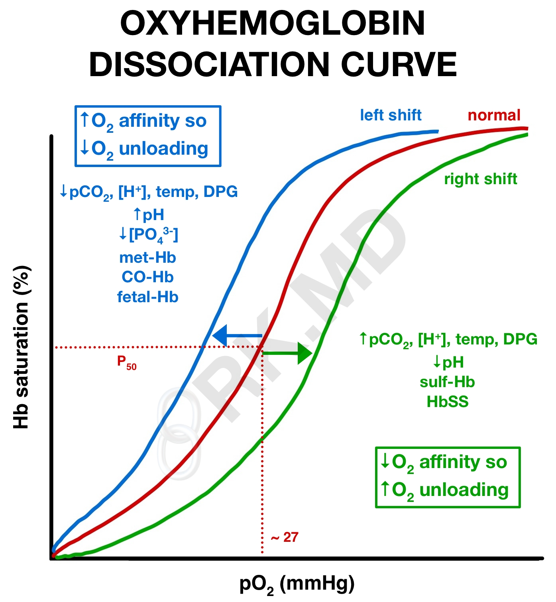

# What impact do factors such as oxygen saturation, pH, and temperature have on ICU patients' oxygen-hemoglobin dissociation curve?

Also - How can we relate this cardiovascular-focused question to patient safety, COVID-19, and/or health equity?

